<p align="center">
  
  
  
  
  
  
  
  
  
</p>

# 🧩 MOBIXA

> **Beyond Reality: The Future of Tech E-Commerce**

MOBIXA is a **premium, cross-platform e-commerce ecosystem** designed to **revolutionize how users interact with and purchase high-end mobile technology**.

The system focuses on **immersive 3D visualization and high-performance bento-grid architecture** and aims to **provide a seamless, desktop-class shopping experience on any device**.

---

# ✨ Key Features

| Feature | Description |
|---|---|
| **Interactive 3D Hero** | Real-time 3D product rendering using O3D/Model-Viewer for immersive previews. |
| **Bento-Grid UI** | Modern, information-dense layout optimized for high-end product presentation. |
| **Cross-Platform Sync** | Unified experience across React Web App and Flutter Mobile App. |
| **Premium Dark Mode** | High-contrast industrial design with glassmorphism and neon accents. |
| **Cart & Order System** | Comprehensive flow from product selection to order history tracking. |

---

# 🎬 Project Demonstration

The following resources demonstrate the system's behavior:

- [📹 Product walkthrough video](#product-video)
- [📸 Screenshots of key features](#screenshots)
- [📄 System architecture overview](#architecture-overview)
- [🧠 Engineering lessons](docs/engineering_lessons.md)
- [🔧 Design decisions](docs/design_decisions.md)
- [🗺️ Roadmap](#roadmap)
- [🚀 Future improvements](#future-improvements)
- [📄 Documentation](#documentation)
- [📝 License](#license)
- [📩 Contact](#contact)

---

<a name="product-video"></a>
# 📹 Product walkthrough video

> **[DEMONSTRATION PENDING]**

*A comprehensive video or GIF of the system's walkthrough demonstrating the Architecture, engines, and core workflows is available soon!*

---

<a name="screenshots"></a>
# 📸 Screenshots of key features

### 🌐 Web Experience (High-Resolution)
The web application features a responsive, high-performance bento-grid interface.

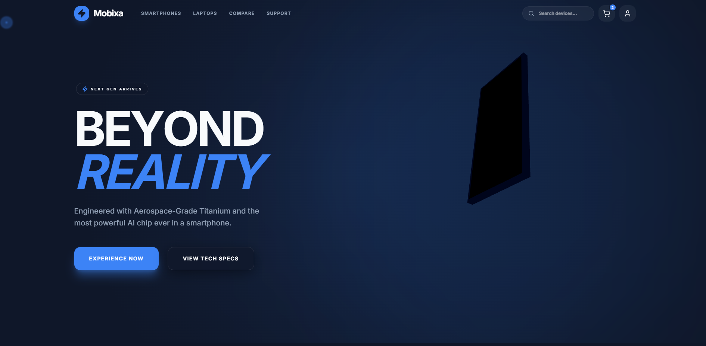
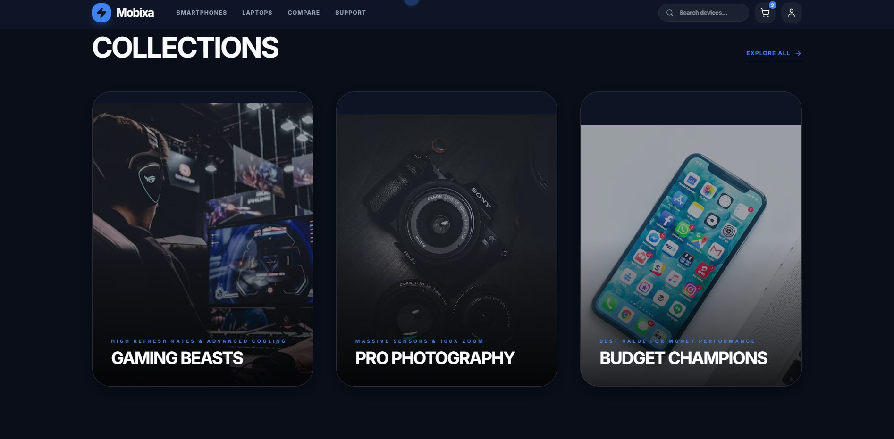
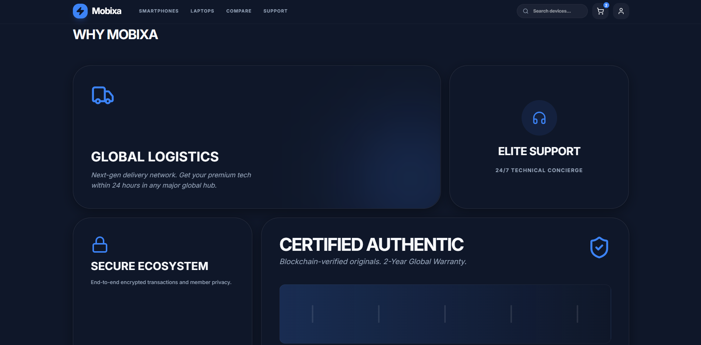
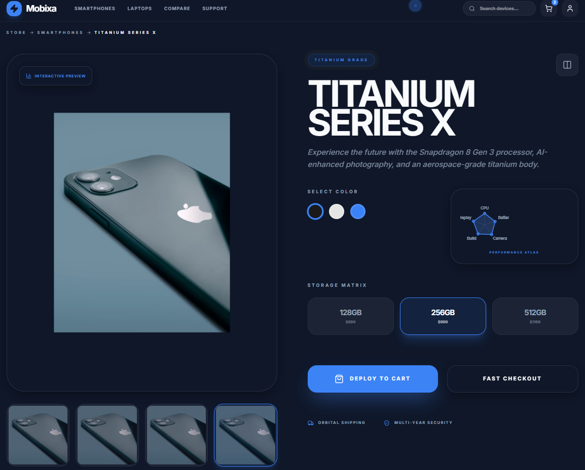
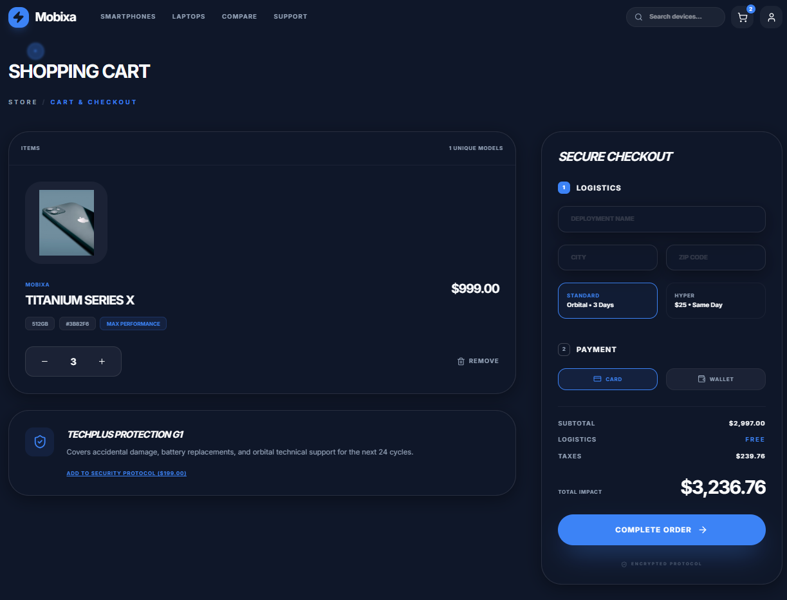
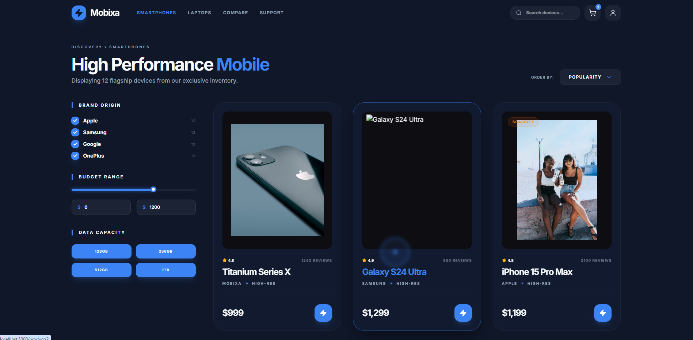
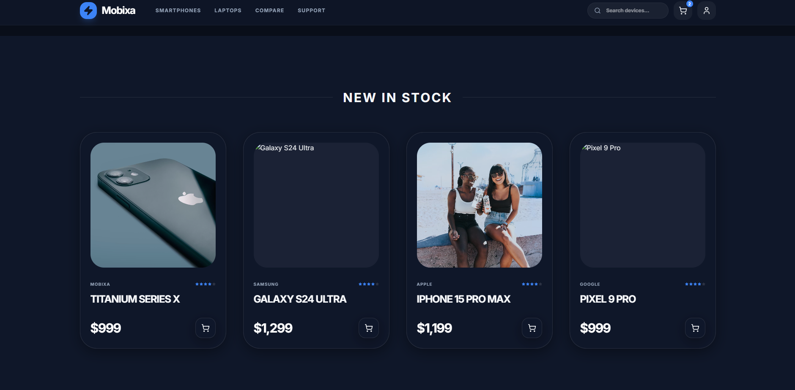
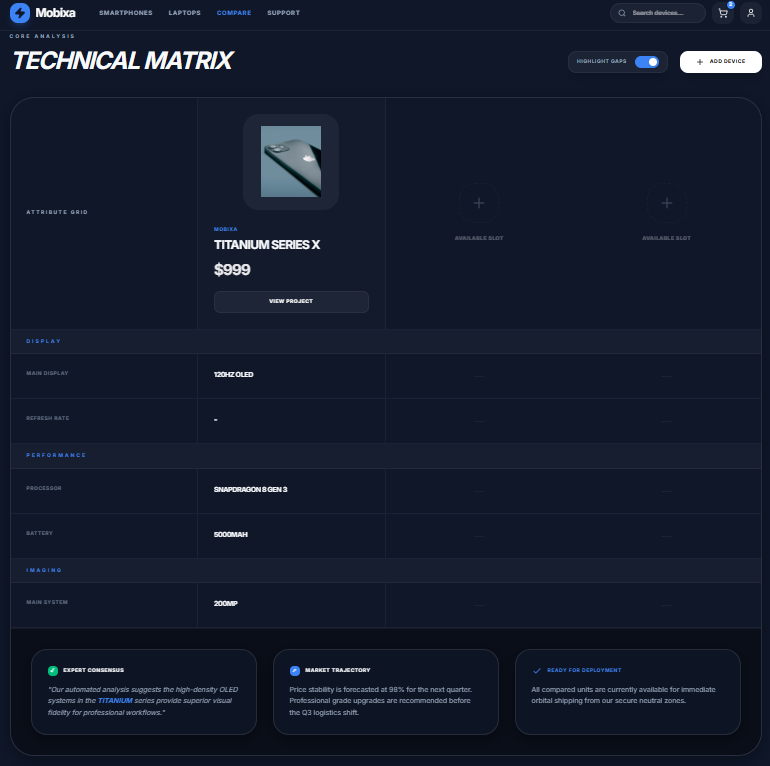
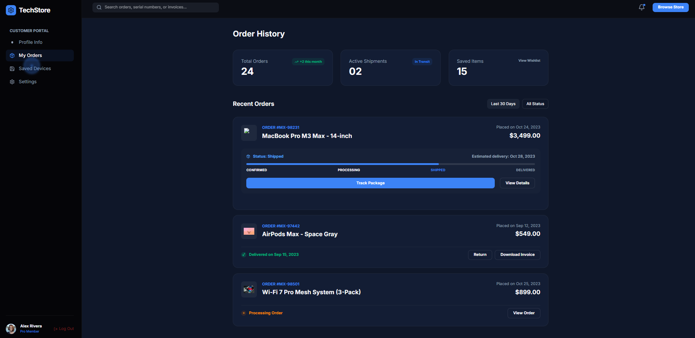
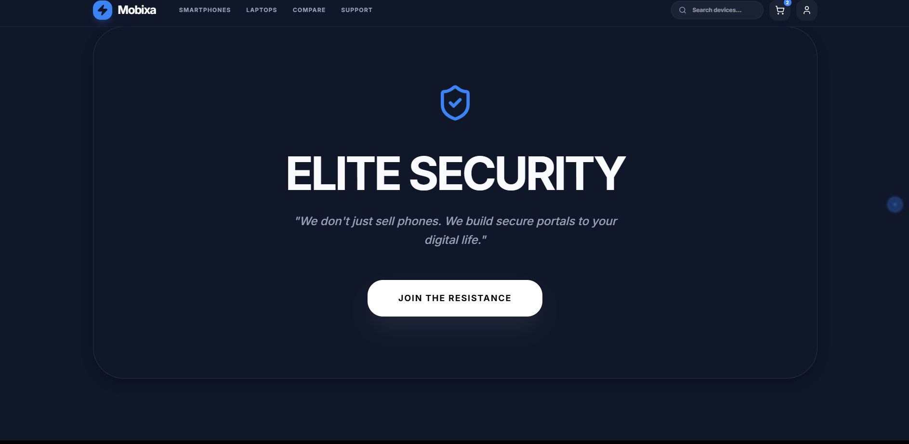

### 📱 Mobile Experience (Native Performance)
The Flutter mobile app delivers a seamless, premium experience on the go.

| Home Hero | Collections | Shopping Cart |
|-----------|-------------|---------------|
| 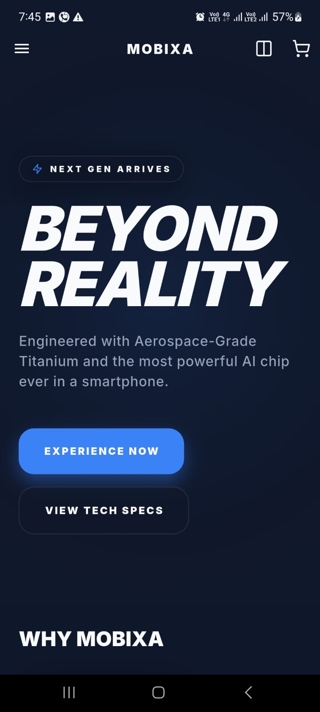 | 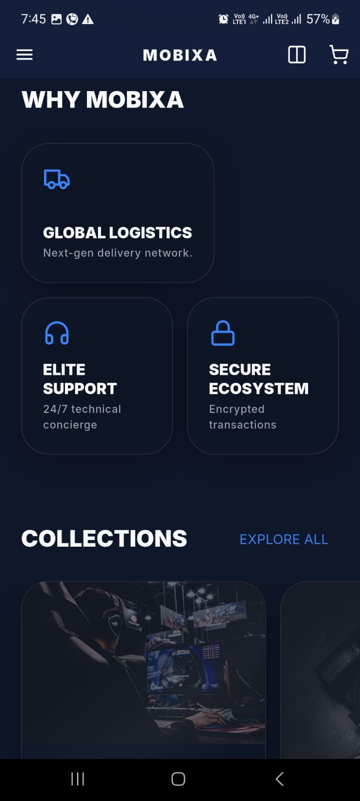 | 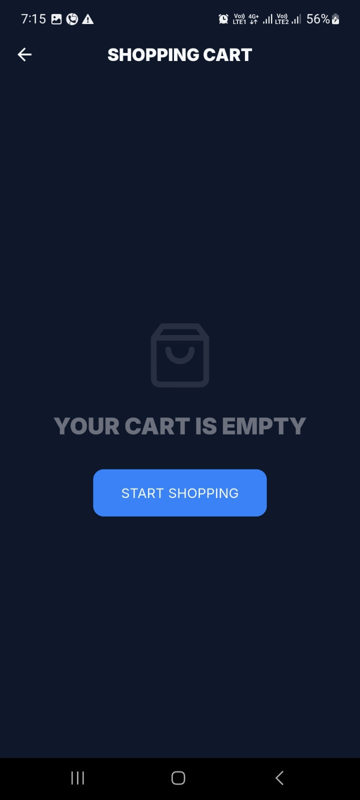 |

| Order History | Profile | New Stock |
|---------------|---------|-----------|
| 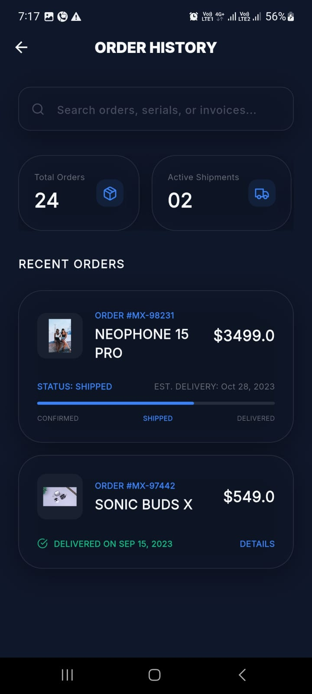 |  | 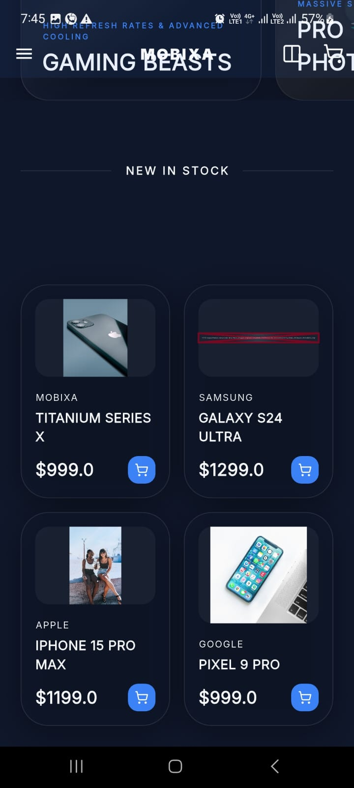 |

| Side Bar | Comparison |
|----------|------------|
| 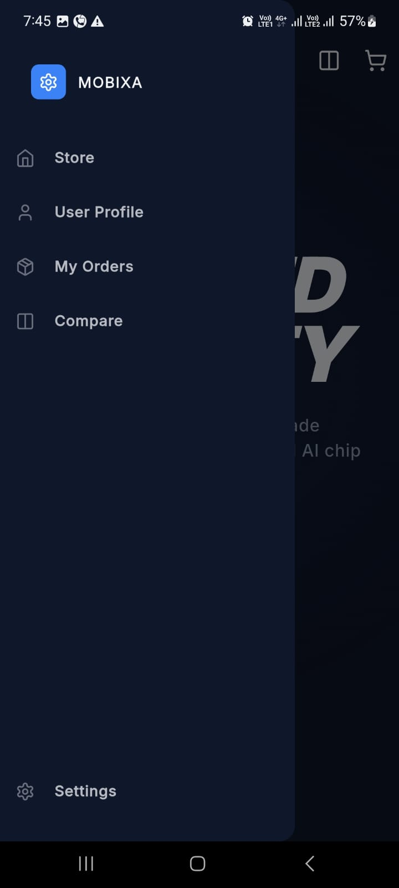 | 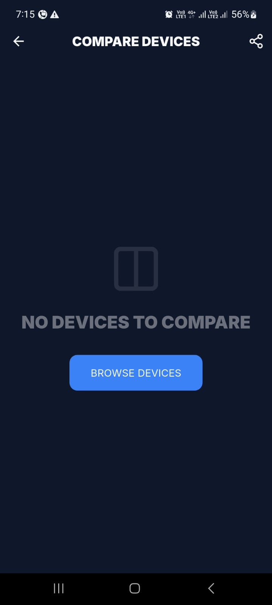 |

---

<a name="architecture-overview"></a>
# 📄 System architecture overview

MOBIXA is implemented using a **Full-Stack MERN & Flutter Architecture**, following a **Layered Monolith** pattern for the backend and **Component-Driven (Modular) Design** for the frontends.

### 🏛️ System Patterns
- **Backend (Repository Pattern)**: Decouples the data access logic from the API routes using a `storage.ts` interface, allowing for easy transitions between different database systems.
- **Web (Atomic-Lite [Modular] Architecture)**: Segregates UI into reusable `components` and specific `pages`, utilizing custom `hooks` for reactive state management.
- **Mobile (Provider Pattern)**: Uses a centralized `providers` layer to manage state and business logic across various `screens` and `components`.
- **Shared Schema**: Uses a `shared/` directory to maintain 1:1 type safety between the server and client using Drizzle/PostgreSQL.

---

# 🧠 Engineering Lessons

*Key technical insights from building the Mobixa ecosystem (See [Full Document](docs/engineering_lessons.md))*:
1. **Real-time 3D Rendering**: Optimized GLB assets and eager loading for 60FPS mobile interaction.
2. **Dynamic Bento-Grid**: Mastered flexible constraints to prevent UI overflow across devices.
3. **Unified Data Sync**: Implemented consistent JSON serialization between React and Flutter.
4. **Environment Hardening**: Configured complex Android permissions & hardware acceleration.
5. **NoSQL Roadmapping**: Strategic pivot from Drizzle/SQL to MongoDB for flexible cataloging.
6. **Architecture Patterns**: Leveraged Repository and Provider patterns for system modularity.

---

# 🔧 Key Design Decisions

*Strategic choices that define the Mobixa experience (See [Full Document](docs/design_decisions.md))*:
1. **The "Obsidian" Theme**: Luxury branding with deep-theme glassmorphism for premium tech.
2. **Bento-Grid Architecture**: Modular layout for dense yet organized product presentation.
3. **Visual Parity**: 1:1 design consistency between React Web and Flutter Mobile platforms.
4. **API-First Strategy**: Decoupled business logic to support multi-client delivery.
5. **3D Interactive Storytelling**: Replacing static images with real-time immersive previews.
6. **Structural Patterns**: Implementing Atomic-Lite and Layered Monolith designs for scaling.

---

<a name="roadmap"></a>
# 🗺️ Roadmap

Key upcoming features planned for MOBIXA:

- **DONE** 3D Hero Integration for Web — Fully interactive real-time 3D product previews.
- **IN PROGRESS** UI/UX Implementation — Enhancing the user interface and user experience.
- **IN PROGRESS** 3D Hero Integration for Mobile — Fully interactive real-time 3D product previews.
- **IN PROGRESS** MongoDB Transition — Migrating from SQL to a flexible NoSQL document model.
- **NOT STARTED** User Authentication — Biometric and OAuth login systems.
- **NOT STARTED** Fully Functional Backend API — Implement all backend API endpoints.

---

<a name="future-improvements"></a>
# 🚀 Future Improvements

Planned enhancements include:
- Real-time alerts via WebSocket.
- Multi-currency and global shipping and `Payment Gateway` API integration.
- Advanced AR (Augmented Reality) shopping experiences.

---

# 🛠️ Installation & Setup

### 📥 Sourcing
```bash
# Clone the repository
git clone https://github.com/VirajTharindu/Mobixa-Mobile-Phone-Store.git
```

### 🐳 Docker (Coming Soon)
```bash
docker-compose up --build
```

### ⚙️ Database Setup
1. Create a `.env` file in the `server` directory.
2. Add your MongoDB URI/Postgres connection string.
3. Run migrations: `npm run db:push`.

---

<a name="documentation"></a>
# 📄 Documentation

| File | Description |
|---|---|
| [Engineering Lessons](docs/engineering_lessons.md) | Deep dive into technical challenges and solutions. |
| [Design Decisions](docs/design_decisions.md) | Architectural and UI/UX philosophy. |

---

<a name="license"></a>
# 📝 License

This project is licensed under the **Apache License 2.0**. It is open-source and free to-use, modify, and distribute for both personal and commercial purposes.

© 2026 Viraj Tharindu — Open Source Contribution.

---

<a name="contact"></a>
# 📩 Contact

Feel free to reach out if you're interested in the technical architecture or collaboration!

**Opportunities for collaboration or professional roles are always welcome.**

📧 Email: [virajtharindu1997@gmail.com](mailto:virajtharindu1997@gmail.com)  
💼 LinkedIn: [LinkedIn](https://www.linkedin.com/in/viraj-tharindu/)  
🌐 Portfolio: [Portfolio](https://vjstyles.com)  
🐙 GitHub: [GitHub](https://github.com/VirajTharindu)  

---

<p align="center">
  <em>Built with ❤️ for the future of Tech E-Commerce! 🚀 ✨</em>
</p>
